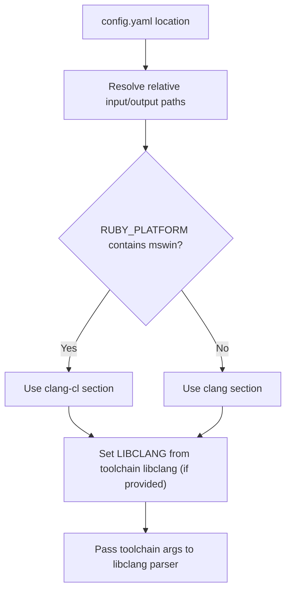

# Configuration

`ruby-bindgen` uses a YAML configuration file to specify how bindings should be generated. This approach keeps your build configuration versioned and reproducible.

```bash
ruby-bindgen rice-bindings.yaml
```

For end-to-end examples, see [C Bindings](c_bindings.md), [C++ Bindings](cpp/cpp_bindings.md), and [CMake Bindings](cmake_bindings.md).

## Required Options

| Option   | Description                                                                                                       |
|----------|-------------------------------------------------------------------------------------------------------------------|
| `input`  | Directory containing the header files to parse. Can be absolute or relative to the config file location.          |
| `output` | Directory where generated binding files will be written. Can be absolute or relative to the config file location. |
| `format` | Type of bindings to generate: `Rice` for C++, `FFI` for C, or `CMake` for CMakeLists.txt. |

Relative paths for `input` and `output` are resolved from the config file's directory, not the current working directory. This makes configs portable across different machines.

## Common Options

These options apply to all formats.

| Option          | Default            | Description                                                                               |
|-----------------|--------------------|-------------------------------------------------------------------------------------------|
| `match`         | `["**/*.{h,hpp}"]` | Array of glob pattern specifying which header files to process.                           |
| `skip`          | `[]`               | Array of glob patterns specifying which files to skip. For Rice/FFI, these match header file paths. For CMake, these match generated `*-rb.cpp` file paths. In most cases, it's better to add skips to the Rice/FFI config so the files are never generated, rather than skipping them in CMake after the fact. |
| `skip_symbols`  | `[]`               | Array of symbols names to skip.  See [Skip Symbols](#skip-symbols).                       |
| `export_macros` | `[]`               | List of macros that indicate a function is exported. See [Export Macros](#export-macros). |

## C (FFI) Options

| Option             | Default | Description |
|--------------------|---------|-------------|
| `library_names`    | `[]`    | Base names of shared libraries to load (e.g., `["proj"]` for `libproj`). |
| `library_versions` | `[]`    | Library version suffixes to search for (e.g., `["25", "9"]`). Combined with `library_names` to build platform-specific search names like `libproj.so.25`. |

## C++ (Rice) Options

| Option          | Default        | Description |
|-----------------|----------------|-------------|
| `project`       | none           | Project name for the Ruby extension. Used for the `Init_` function name and project wrapper file names. Must be a valid C/C++ identifier. When provided, generates project wrapper files (`{project}-rb.cpp`, `{project}-rb.hpp`). When omitted, only per-file bindings are generated. |
| `include`       | auto-generated | Path to a custom Rice include header. See [Include Header](cpp/cpp_bindings.md#include-header). |
| `type_mappings` | `[]` | Override generated Ruby class names. Array of `{from, to}` entries where `from` is a string or `/regex/` pattern and `to` is the replacement (supports `\1` capture groups). See [Name Mappings](#name-mappings). |
| `method_mappings` | `[]` | Override generated Ruby method names. Array of `{from, to}` entries where `from` is a C++ qualified name or `/regex/` pattern and `to` is the Ruby name. See [Name Mappings](#name-mappings). |

## CMake Options

| Option         | Default | Description |
|----------------|---------|-------------|
| `project`      | none    | Project name used in the CMake `project()` command and build target name. When provided, generates the root `CMakeLists.txt` (with project setup, Rice fetch, Ruby detection) and `CMakePresets.json`. When omitted, only subdirectory `CMakeLists.txt` files are generated — useful when you manage the root project files yourself. |
| `include_dirs` | `[]`    | List of include directory expressions added via `target_include_directories`. These are CMake expressions written directly into `CMakeLists.txt` (e.g., `${CMAKE_CURRENT_SOURCE_DIR}/../headers`). |

## Compiler Toolchain

`ruby-bindgen` uses top-level toolchain keys to configure compiler settings for different platforms:

- **`clang-cl:`** - Used when Ruby is built with MSVC (`RUBY_PLATFORM` contains `mswin`)
- **`clang:`** - Used for all other platforms (Linux, macOS, MinGW)

| Option     | Default     | Description |
|------------|-------------|-------------|
| `libclang` | auto-detect | Path to the libclang shared library. Nested under `clang-cl:` or `clang:`. When specified, sets the `LIBCLANG` environment variable before loading ffi-clang. |
| `args`     | `[]`        | Arguments passed to libclang for parsing (include paths, language standard, defines, etc.). Nested under `clang-cl:` or `clang:`. |

You only need to include the toolchain sections for platforms you target.

### Resolution Flow



### Clang Arguments

The `args` section under each toolchain is crucial for successful parsing. You typically need:

1. **System include paths** - Standard library headers
2. **Library include paths** - The library's own headers
3. **Language specification** - `-xc++` for C++ headers, `-xc` for C headers
4. **Language standard** - `-std=c++17` or similar

#### Finding System Include Paths

On Linux/macOS:
```bash
clang++ -E -x c++ - -v < /dev/null 2>&1 | grep "^ /"
```

On Windows with MSVC:
- Visual Studio include paths (e.g., `C:\Program Files\Microsoft Visual Studio\...\include`)
- Windows SDK include paths (e.g., `C:\Program Files (x86)\Windows Kits\10\Include\...`)
- LLVM/Clang include paths if using clang

### Finding Libclang

On Linux:
```bash
# Common locations
/usr/lib64/libclang.so           # Fedora, RHEL
/usr/lib/x86_64-linux-gnu/libclang-*.so  # Debian, Ubuntu
/usr/lib/llvm-*/lib/libclang.so  # Multiple LLVM versions

# Find all libclang installations
find /usr -name "libclang*.so" 2>/dev/null
```

On macOS:
```bash
# Homebrew LLVM
/opt/homebrew/opt/llvm/lib/libclang.dylib  # Apple Silicon
/usr/local/opt/llvm/lib/libclang.dylib     # Intel

# Xcode Command Line Tools
/Library/Developer/CommandLineTools/usr/lib/libclang.dylib
```

On Windows:
```
# Visual Studio bundled LLVM
C:\Program Files\Microsoft Visual Studio\2022\...\VC\Tools\Llvm\x64\bin\libclang.dll

# Standalone LLVM installation
C:\Program Files\LLVM\bin\libclang.dll
```

## Skip Symbols

The `skip_symbols` option is useful when:

- Functions have export macros but still aren't available (build configuration issues)
- Functions are internal/private APIs not meant for external use
- Functions cause linker errors due to missing symbols

You can specify symbols using:

- Simple names: `versionMajor` - skips all symbols with this name
- Fully qualified names: `cv::ocl::PlatformInfo::versionMajor` - skips only that specific symbol
- Regex patterns: `/pattern/` - skips symbols matching the regex

```yaml
skip_symbols:
  - versionMajor                           # Skips all symbols named "versionMajor"
  - cv::ocl::PlatformInfo::versionMinor    # Skips only this specific method
  - /cv::dnn::.*Layer::init.*/             # Regex: skips all init* methods on any Layer class
```

### Regex Patterns

Regex patterns are enclosed in forward slashes (`/pattern/`) and are matched against both the simple symbol name and the fully qualified name. This is particularly useful for:

- Matching across versioned inline namespaces (e.g., `cv::dnn::dnn4_v20241223::Layer`)
- Skipping families of related methods
- Handling template specializations

`ruby-bindgen` automatically skips:

- Deprecated functions (marked with `__attribute__((deprecated))`)
- Internal functions (names ending with `_`)
- Methods returning pointers to incomplete types (pimpl pattern)

## Export Macros

The `export_macros` option filters functions based on the presence of specific macros in the source code. This is useful for libraries that use macros to control symbol visibility.

When specified, only functions whose source text contains at least one of the listed macros will be included in the bindings. This prevents linker errors from trying to wrap internal functions that aren't exported from the shared library.

```yaml
export_macros:
  - CV_EXPORTS
  - CV_EXPORTS_W
```

### Common Library Macros

| Library | Export Macros |
|---------|--------------|
| OpenCV | `CV_EXPORTS`, `CV_EXPORTS_W`, `CV_EXPORTS_W_SIMPLE` |
| Qt | `Q_DECL_EXPORT`, `Q_CORE_EXPORT` |
| Boost | `BOOST_*_DECL` |

## Name Mappings

ruby-bindgen applies heuristics to convert C++ names to Ruby names — for example, `isEnabled()` becomes `enabled?` and `operator()` becomes `call`. These heuristics sometimes guess wrong. The `method_mappings` and `type_mappings` options let you override the generated names without manual post-generation edits.

Both options use the same pattern syntax as `skip_symbols`: plain strings for exact match, `/pattern/` for regex.

### Type Mappings

Override generated Ruby class names for template instantiations. Supports `\1`, `\2`, etc. capture group substitution in regex replacements.

```yaml
type_mappings:
  # OpenCV Matx naming convention: MatxUnsignedChar21 → Matx21b
  - from: /^MatxUnsignedChar(\d+)$/
    to: Matx\1b
  - from: /^MatxUnsignedShort(\d+)$/
    to: Matx\1w
  - from: /^MatxShort(\d+)$/
    to: Matx\1s
  - from: /^MatxInt(\d+)$/
    to: Matx\1i
```

Without these overrides, `Matx<unsigned char, 2, 1>` would generate the Ruby class name `MatxUnsignedChar21`. With the mapping, it becomes `Matx21b`, matching OpenCV's naming convention.

### Method Mappings

Override generated Ruby method names. The `from` field is a C++ name (simple or fully qualified), the `to` field is the desired Ruby name.

```yaml
method_mappings:
  # Exact match by qualified name — grab is not a predicate, it grabs a frame
  - from: cv::VideoCapture::grab
    to: grab
  # Override operator() → [] for element/ROI access
  - from: cv::Mat::operator()
    to: "[]"
  - from: cv::UMat::operator()
    to: "[]"
  # Override operator() → to_size for MatSize (returns a Size, not element access)
  - from: cv::MatSize::operator()
    to: to_size
```

Without these overrides, ruby-bindgen would generate `grab?` (bool return, no params triggers predicate heuristic) and `call` (default `operator()` mapping).
