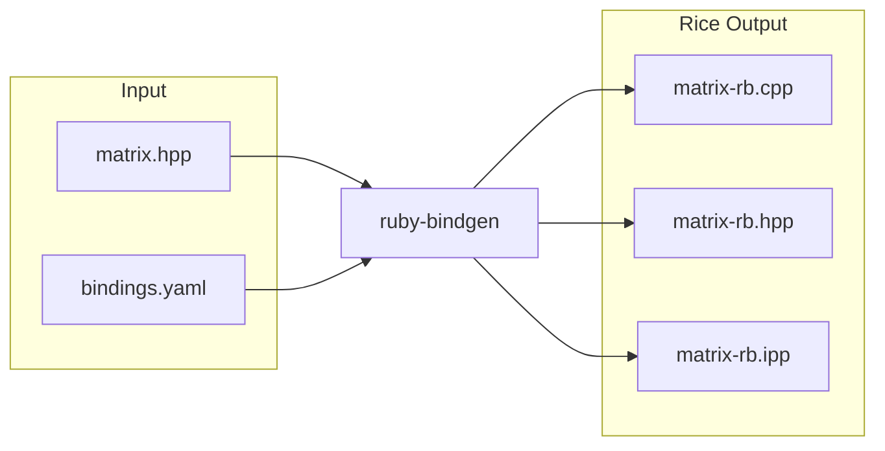
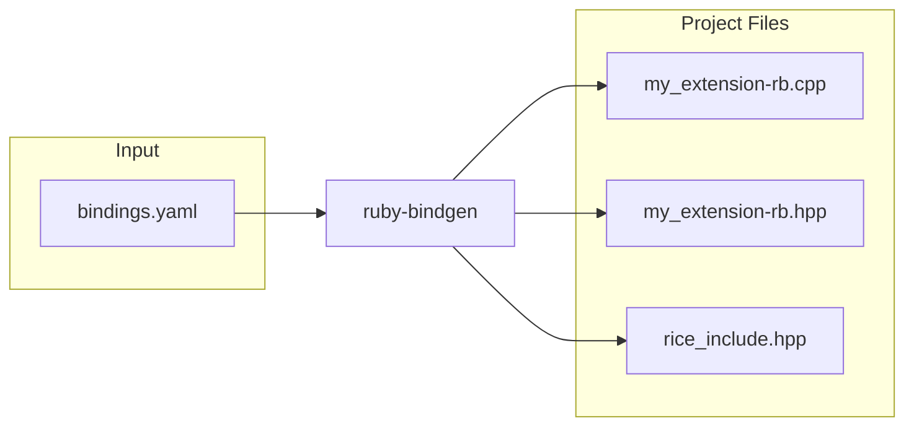
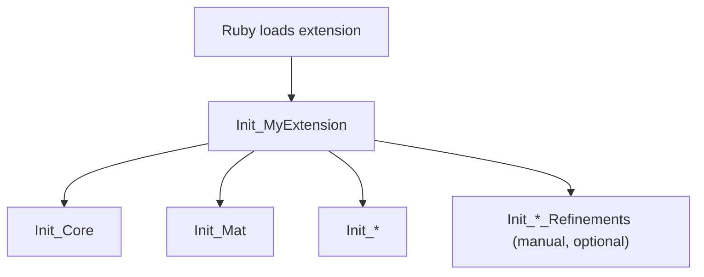

# C++ Bindings

`ruby-bindgen` creates Ruby bindings for C++ libraries using [Rice](https://github.com/ruby-rice/rice). Creating C++ bindings takes more work than creating C bindings, so if a library provides both a C and C++ API you should use the C API.

`ruby-bindgen` does its best to generate compilable Rice code. It has been battle tested against [OpenCV](https://github.com/opencv/opencv), which is a large, complex C++ API with over a thousand classes and ten thousand methods. 

For many libraries, the generated bindings will compile and work with no additional changes. For example, Rice includes a fully automated example binding for the [BitmapPlusPlus](https://ruby-rice.github.io/BitmapPlusPlus-ruby/) library.

For more complex libraries, like [OpenCV](https://github.com/opencv/opencv), some [customization](customizing.md) will likely be required.

## Configuration

Below is an example `bindings.yaml` configuration file:

```yaml
extension: my_extension
input: ./include
output: ./ext/generated
format: Rice

match:
  - "**/*.hpp"

clang:
  args:
    - -I./include
    - -std=c++17
    - -xc++
```

To generate bindings run:

```bash
ruby-bindgen bindings.yaml
```

## Output

### Header Files

For every C++ header file, `ruby-bindgen` generates a .hpp and .cpp file. These files have the same name as the C++ header but with the addition of `-rb` at the end. For example, a C++ header file called `matrix.hpp` will generate in `matrix-rb.hpp` and `matrix-rb.cpp`. If the C++ header file declares a template class, then a third file will be generated called `matrix-rb.ipp`.



The `.hpp` file declares an `Init_` function (e.g., `Init_Matrix`) that registers the classes, methods, and enums from that header with Rice.

The `.cpp` file defines that `Init_` function with the actual Rice bindings code.

The `.ipp` file is only generated when the header declares template classes. It contains one `_instantiate` function per template class that can be used to instantiate the template. The `-rb.ipp` files can be reused across translated units. See [Templates](templates.md#template-instantiate-files-ipp) for details.

### Init Function Names

Each generated file has an `Init_` function. To avoid conflicts when multiple files have the same name in different directories (e.g., `core/version.hpp` and `dnn/version.hpp`), the function name includes the directory path:

| File Path | Init Function |
|-----------|---------------|
| `version.hpp` | `Init_Version` |
| `core/version.hpp` | `Init_Core_Version` |
| `dnn/version.hpp` | `Init_Dnn_Version` |
| `core/hal/interface.hpp` | `Init_Core_Hal_Interface` |

The top-level directory is always removed to avoid overly long names (e.g., `opencv2/calib3d.hpp` becomes `Init_Calib3d`, and `opencv2/core/version.hpp` becomes `Init_Core_Version`).

### Project Files

When you set the `extension` option in your configuration, `ruby-bindgen` also generates project-level wrapper files that tie everything together:



* `my_extension-rb.hpp` declares the main Ruby init function `Init_MyExtension` with the appropriate export attribute (`__declspec(dllexport)` on Windows, `__attribute__((visibility("default")))` on Linux/macOS)
* `my_extension-rb.cpp` defines `Init_MyExtension`, which calls each per-header `Init_` function (e.g., `Init_Matrix`, `Init_Image`, `Init_Filter`)
* `rice_include.hpp` is the default [include header](#include-header) that all generated translation units include

To suppress project file generation, omit the `extension` option from your configuration. This is useful when you want to manage the top-level init function yourself.

## Include Header

By default `ruby-bindgen` creates a default include files called `rice_include.hpp`. Its content is:

```cpp
#pragma once

// Default Rice include header generated by ruby-bindgen
// To customize, create your own header and specify it with the 'include:' config option
#include <rice/rice.hpp>
#include <rice/stl.hpp>
```
If the `rice_include.hpp` already exists, `ruby-bindgen` will not overwrite it.

All generated headers include this file:

```cpp
#include "../../rice_include.hpp"  // relative path computed automatically

void Init_MyClass();
```

Remember that C++ templates are instantiated per translation unit. If different translation units see different template definitions (e.g., one sees a `Type<T>` specialization and another doesn't), this causes an ODR (One Definition Rule) violation. The linker may silently pick the wrong instantiation, leading to subtle bugs.

By centralizing all Rice includes in a single header that every generated file includes, all translation units see the same template definitions, preventing ODR violations.

The include header is an ideal candidate for precompiled headers (PCH). Since every generated file includes it, precompiling this header can significantly speed up build times:

```cmake
# CMake example
target_precompile_headers(my_extension PRIVATE
  "${CMAKE_SOURCE_DIR}/rice_include.hpp"
)
```

You can specify a custom include file by setting the `include` option in the configuration file. This will replace the default `rice_include.hpp` file and thus allow you to specify your own `include` files if necessary. Your custom header must include the Rice headers, plus any addition includes or definitions you want to be global.

For example, it is a good place to add support for custom smart pointers. For example, OpenCV defines `cv::Ptr<T>` which inherits from `std::smart_pointer<T>`. The opencv-ruby bindings wrapp this smart pointer in a custom header file that is then added to `rice_includes.hpp`. That means all translation units see it, preventing ODR violations.

A custom include file will not be overwritten by `ruby-bindgen`.

## Init Function Call Graph

When Ruby loads an extension, it calls the top-level `Init_<extension>` function, which in turn calls each per-header `Init_*` function to register classes, methods, and enums.



The extension `Init_<extension>` function is the top-level entry point and calls all per-header `Init_*` functions. Refinement init functions are optional manual hooks that run after generated definitions. See [refinements](customizing.md#refinements-separate-manual-code) for details.

## Build System

After generating Rice bindings, you will need to setup a build system for your extension. `ruby-bindgen` can generate [CMake build files](../cmake_bindings.md) to compile and link the generated bindings.

## Example

For a complete, fully automated example see [BitmapPlusPlus-ruby](https://ruby-rice.github.io/BitmapPlusPlus-ruby/).
