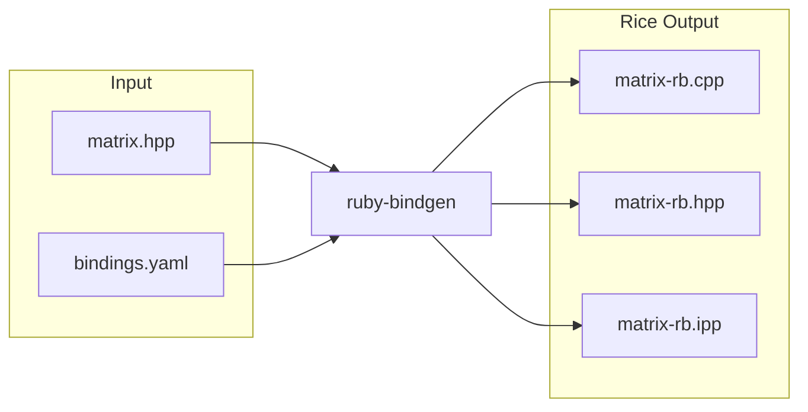
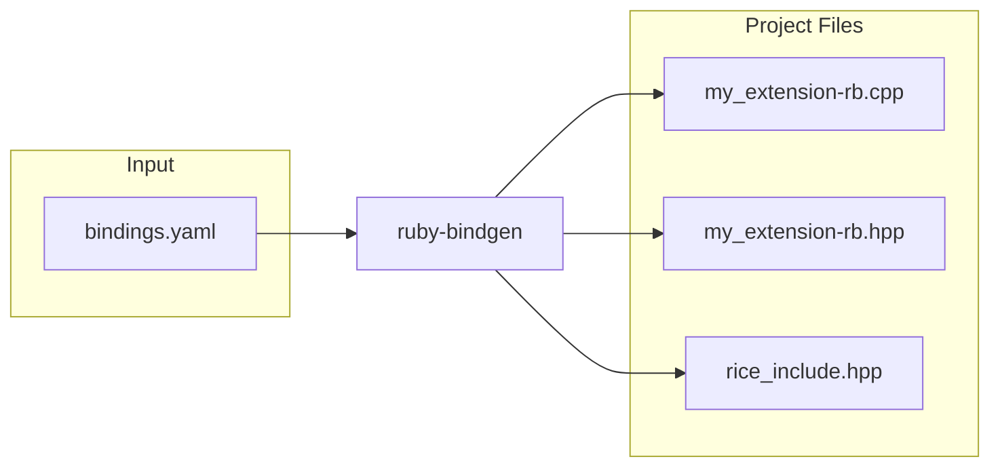
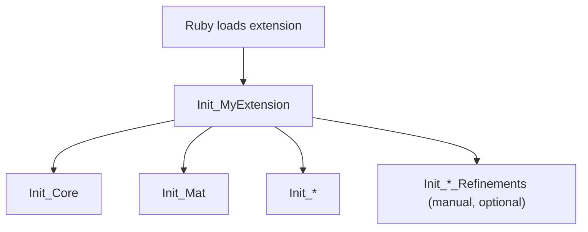

# C++ Bindings

`ruby-bindgen` creates Ruby bindings for C++ libraries using [Rice](https://github.com/ruby-rice/rice). Creating C++ bindings takes more work than creating C bindings, so if a library provides both a C and C++ API you should use the C API.

`ruby-bindgen` does its best to generate compilable Rice code. It has been battle tested against [OpenCV](https://github.com/opencv/opencv), which is a large, complex C++ API with over a thousand classes and ten thousand methods. 

For many libraries, the generated bindings will compile and work with no additional changes. For example, Rice includes a fully automated example binding for the [BitmapPlusPlus](https://ruby-rice.github.io/BitmapPlusPlus-ruby/) library.

For more complex libraries, like [OpenCV](https://github.com/opencv/opencv), some [customization](customizing.md) will likely be required.

## Configuration

Below is an example `bindings.yaml` configuration file:

```yaml
extension: my_extension
input: ./include
output: ./ext/generated
format: Rice

match:
  - "**/*.hpp"

clang:
  args:
    - -I./include
    - -std=c++17
    - -xc++
```

To generate bindings run:

```bash
ruby-bindgen bindings.yaml
```

## Output

### Header Files

For every C++ header file, `ruby-bindgen` generates a .hpp and .cpp file. These files have the same name as the C++ header but with the addition of `-rb` at the end. For example, a C++ header file called `matrix.hpp` will generate in `matrix-rb.hpp` and `matrix-rb.cpp`. If the C++ header file declares a template class, then a third file will be generated called `matrix-rb.ipp`.



The `.hpp` file declares an `Init_` function (e.g., `Init_Matrix`) that registers the classes, methods, and enums from that header with Rice.

The `.cpp` file defines that `Init_` function with the actual Rice bindings code.

The `.ipp` file is only generated when the header declares class templates with `typedef` or `using` specializations. It contains `_instantiate` functions that can be reused across translation units. See [Templates](templates.md#template-instantiate-files-ipp) for details.

### Project Files

When the `extension` option is set in your configuration, `ruby-bindgen` also generates project-level wrapper files that tie everything together:



* `my_extension-rb.hpp` declares the main Ruby init function `Init_MyExtension` with the appropriate export attribute (`__declspec(dllexport)` on Windows, `__attribute__((visibility("default")))` on Linux/macOS)
* `my_extension-rb.cpp` defines `Init_MyExtension`, which calls each per-header `Init_` function (e.g., `Init_Matrix`, `Init_Image`, `Init_Filter`)
* `rice_include.hpp` is the default [include header](#include-header) that all generated translation units include (named `{extension}_include.hpp` when an extension is specified)

To suppress project file generation, omit the `extension` option from your configuration. This is useful when you want to manage the top-level init function yourself.

## Init Function Call Graph

When Ruby loads an extension, it calls the top-level `Init_<extension>` function, which in turn calls each per-header `Init_*` function to register classes, methods, and enums.



The extension `Init_<extension>` function is the top-level entry point and calls all per-header `Init_*` functions. Refinement init functions are optional manual hooks that run after generated definitions. See [refinements](customizing.md#refinements-separate-manual-code) for details.

## Build System

Next you need to set up a build system for your extension. `ruby-bindgen` can generate [CMake build files](../cmake_bindings.md) to compile and link the generated bindings.

## Naming Conventions

`ruby-bindgen` follows Ruby naming conventions. It converts C++ names to their appropriate Ruby equivalents: `UpperCase` for class names, `CAPITALIZED` for constants, `under_score` for methods, etc.

In addition, methods that return boolean values have `?` appended to their names and `is_` removed if present. For example, `is_open` becomes `open?`.

## Include Header

The `include` option specifies a custom header file that all generated translation unit headers will include. This header centralizes Rice includes and any custom type support your bindings require. For details on Rice's type system and custom `Type<T>` specializations, see the Rice [Type Verification](https://ruby-rice.github.io/4.x/types/verification/) documentation.

### Default Behavior

When `include` is not specified, `ruby-bindgen` generates a default header named `rice_include.hpp` (or `{extension}_include.hpp` when an extension is specified):

```cpp
// Default Rice include header generated by ruby-bindgen
// To customize, create your own header and specify it with the 'include:' config option
#include <rice/rice.hpp>
#include <rice/stl.hpp>
```

All generated headers include this file:

```cpp
#include "../../rice_include.hpp"  // relative path computed automatically

void Init_MyClass();
```

### Custom Include Header

Specify a custom header when you need:

- Custom `Rice::detail::Type<T>` specializations for smart pointers or other types
- Additional Rice headers like `<rice/rice_api.hpp>`
- Project-specific includes or macros

Your custom header must include the Rice headers:

```cpp
// my_rice_include.hpp
#include <rice/rice.hpp>
#include <rice/stl.hpp>

// Custom Type specialization for library's smart pointer
namespace Rice::detail
{
  template<typename T>
  struct Type<MyLib::Ptr<T>>
  {
    static bool verify()
    {
      // Register the smart pointer type with Rice
      define_mylib_ptr<T>();
      return Type<T>::verify();
    }
  };
}
```

### Why This Matters

C++ templates are instantiated per translation unit. If different translation units see different template definitions (e.g., one sees a `Type<T>` specialization and another doesn't), this causes an ODR (One Definition Rule) violation. The linker may silently pick the wrong instantiation, leading to subtle bugs.

By centralizing all Rice includes in a single header that every generated file includes, all translation units see the same template definitions, preventing ODR violations.

### Precompiled Headers

The include header is an ideal candidate for precompiled headers (PCH). Since every generated file includes it, precompiling this header can significantly speed up build times:

```cmake
# CMake example
target_precompile_headers(my_extension PRIVATE
  "${CMAKE_SOURCE_DIR}/my_rice_include.hpp"
)
```

### Smart Pointers

Custom smart pointer types (like `cv::Ptr<T>`) can be supported via the include header. Create a header with a `Rice::detail::Type<T>` specialization and all translation units will see it, preventing ODR violations.

## Example

For a complete, fully automated example see [BitmapPlusPlus-ruby](https://ruby-rice.github.io/BitmapPlusPlus-ruby/).
