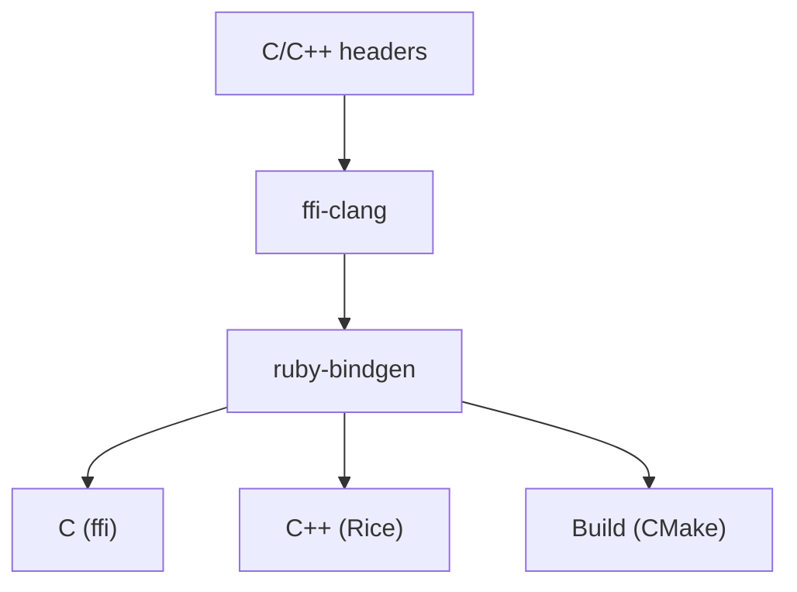
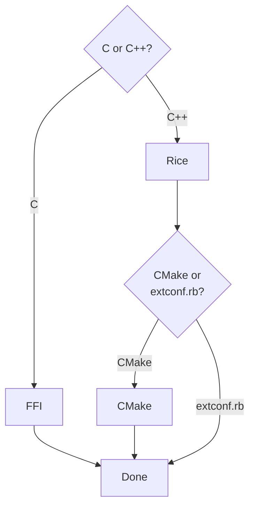

# ruby-bindgen

Wrapping C and C++ libraries by hand is a long, arduous task. For large, complex libraries it can take months. As a result, many C/C++ libraries are either never exposed to Ruby or their bindings quickly become outdated, especially in scientific and technical domains.

`ruby-bindgen` and its ecosystem solve this problem by automating binding generation. For simpler libraries, it should be able to generate fully working bindings while complex libraries may require some [customization](cpp/customizing.md).

As an example, there used to be hand-crafted Ruby [bindings](https://github.com/ruby-opencv/ruby-opencv) for [OpenCV](https://opencv.org/). However, they were based on the C API which was subsequently remove by the OpenCV project. `ruby-bindgen` was used to create new [bindings](https://github.com/cfis/opencv-ruby) based on the new C++ API. The bindings wrap over [1,000](https://cfis.github.io/opencv-ruby/) C++ classes and almost [10,000](https://cfis.github.io/opencv-ruby/) method calls. Imagine having to do that by hand!

## Ecosystem
`ruby-bindgen` is one part of the C/C++ to Ruby toolchain.



The components of the toolchain include:

- [ffi-clang](https://github.com/ioquatix/ffi-clang) - exposes [libclang](https://clang.llvm.org/) parsing APIs to Ruby.
- [ruby-bindgen](https://github.com/ruby-rice/ruby-bindgen) - generates bindings.
- [FFI](https://github.com/ffi/ffi) - enables direct C library calls from Ruby without compiling a C extension.
- [Rice](https://github.com/ruby-rice/rice) - handles C++/Ruby type conversion and native extension integration.
- [CMake](https://cmake.org/) - builds generated Rice wrappers into loadable extension binaries.

## Installation

To install `ruby-bindgen` run the following command:

```console
gem install ruby-bindgen
```

## Getting Started

`ruby-bindgen` is driven by a [configuration](configuration.md) file. To get started, first decide what type of library you are wrapping:



If a library provides both C and C++ APIs, use the C API! It is usually simpler to wrap and maintain and does not require users to compile extensions.

Once you have decided the format, create a simple [configuration](configuration.md) file and set its `format` field to `FFI`, `Rice` or `CMake`. In addition, specify an `extension` name, the `input` path to header files and the `output` path for generated bindings.

For example:

```yaml
extension: my_extension
input: /path/to/headers
output: /path/to/output
format: Rice     # or FFI/CMake

match:
  - "**/*.hpp"   # or "**/*.h" for C headers

clang:
  args:
    - -I/path/to/includes
    - -xc++      # omit for C libraries
```
See [Configuration](configuration.md) for all options.

For much more details, jump to the documentation page for each format:

| Format    | Next Step                           |
|-----------|-------------------------------------|
| **FFI**   | [C Bindings](c_bindings.md)         |
| **Rice**  | [C++ Bindings](cpp/cpp_bindings.md)     |
| **CMake** | [CMake Bindings](cmake_bindings.md) |

Finally generate bindings by running the command:

```bash
ruby-bindgen config.yaml
```
