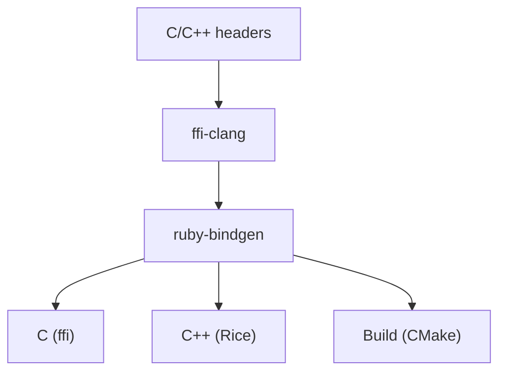
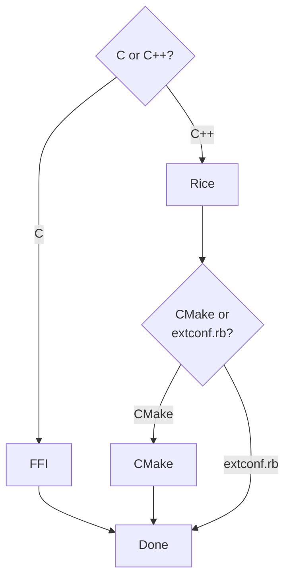

# ruby-bindgen

Wrapping C and C++ libraries by hand is a long, arduous task. For large, complex libraries it can take months. As a result, many C/C++ libraries are either never exposed to Ruby or their bindings quickly become outdated, especially in scientific and technical domains.

`ruby-bindgen` and its ecosystem solve this problem by automating binding generation. For simpler libraries, it should be able to generate fully working bindings while complex libraries may require some [customization](#customization).

As an example, there used to be hand-crafted Ruby [bindings](https://github.com/ruby-opencv/ruby-opencv) for [OpenCV](https://opencv.org/). However, they were based on the C API which was subsequently remove by the OpenCV project. `ruby-bindgen` was used to create new [bindings](https://github.com/cfis/opencv-ruby) based on the new C++ API. The bindings wrap over [1,000](https://cfis.github.io/opencv-ruby/) C++ classes and almost [10,000](https://cfis.github.io/opencv-ruby/) method calls. Imagine having to do that by hand!

## Ecosystem
`ruby-bindgen` is part of the C/C++ to Ruby toolchain.


```mermaid
flowchart TD
  H["C/C++ headers"] --> CL["ffi-clang"]
  CL --> RB["ruby-bindgen"]
  RB --> F["C (ffi)"]
  RB --> R["C++ (Rice)"]
  RB --> C["Build (CMake)"]

  click CL "https://github.com/ioquatix/ffi-clang" "ffi-clang"
  click RB "https://github.com/ruby-rice/ruby-bindgen" "ruby-bindgen"
  click R "https://github.com/ruby-rice/rice" "Rice"
  click F "https://github.com/ffi/ffi" "FFI"
  click C "https://cmake.org/" "CMake"
```

The components of the toolchain include:

- [ffi-clang](https://github.com/ioquatix/ffi-clang) - exposes [libclang](https://clang.llvm.org/) parsing APIs to Ruby.
- [ruby-bindgen](https://github.com/ruby-rice/ruby-bindgen) - generates bindings.
- [FFI](https://github.com/ffi/ffi) - enables direct C library calls from Ruby without compiling a C extension.
- [Rice](https://github.com/ruby-rice/rice) - handles C++/Ruby type conversion and native extension integration.
- [CMake](https://cmake.org/) - builds generated Rice wrappers into loadable extension binaries.

## Prerequisites

- Ruby 3.2 or later
- libclang (provided by LLVM/Clang)

## Installation

To install `ruby-bindgen` run the following command:

```console
gem install ruby-bindgen
```

## Getting Started

`ruby-bindgen` is driven by a [configuration](configuration.md) file. To get started, first decide what type of library you are wrapping:


```mermaid
flowchart TD
  A{"C or C++?"}
  A -->|C| B["FFI"]
  A -->|C++| C["Rice"]
  C --> D{"CMake or<br/>extconf.rb?"}
  D -->|CMake| E["CMake"]
  D -->|extconf.rb| F["Done"]
  B --> F
  E --> F

  click B "c/c_bindings.md" "C Bindings"
  click C "cpp/cpp_bindings.md" "C++ Bindings"
  click E "cmake_bindings.md" "CMake Bindings"
  click D "https://ruby-rice.github.io/4.x/packaging/extconf/" "Rice extconf.rb packaging"
```

If a library provides both C and C++ APIs, use the C API! It is usually simpler to wrap and maintain and does not require users to compile extensions.

Once you have decided the format, create a simple [configuration](configuration.md) file and set its `format` field to `FFI`, `Rice` or `CMake`.

- `output` is always required
- `input` is required for `FFI` and `Rice`; for `CMake` it defaults to `output`
- `project` is required for `FFI` and optional for `Rice` and `CMake`

For example, a minimal Rice configuration looks like:

```yaml
project: my_extension
input: /path/to/headers
output: /path/to/output
format: Rice

match:
  - "**/*.hpp"   # use "**/*.h" for C headers in FFI configs

clang:
  args:
    - -I/path/to/includes
    - -xc++      # omit for C libraries
```
See [Configuration](configuration.md) for all options.

For much more details, jump to the documentation page for each format:

| Format    | Next Step                           |
|-----------|-------------------------------------|
| **FFI**   | [C Bindings](c/c_bindings.md)       |
| **Rice**  | [C++ Bindings](cpp/cpp_bindings.md)     |
| **CMake** | [CMake Bindings](cmake_bindings.md) |

Finally generate bindings by running the command:

```bash
ruby-bindgen /path/to/bindings.yaml
```

## Naming Conventions

`ruby-bindgen` follows Ruby naming conventions for both C and C++ bindings:

- Class/Module names: `UpperCamelCase`
- Constants: `UPPER_CASE`
- Methods/Functions: `snake_case`
- Enum values: `snake_case` symbols (FFI) or scoped constants (Rice)

In addition, methods that return boolean values have `?` appended to their names and `is_` removed if present. For example, `is_open` becomes `open?`.

## Customization

Out of the box, `ruby-bindgen` applies sensible defaults and heuristics. For most libraries you will need to fine-tune the output. The [configuration](configuration.md) file provides several knobs:

- **[Symbol filtering](configuration.md#symbols)** — skip functions, classes, enums, typedefs, unions, or variables by name or regex pattern. Useful for internal APIs, linker-error symbols, or platform-specific code.
- **[Symbol overrides](configuration.md#overrides-ffi-only)** (FFI) — replace a generated function signature when the heuristics pick the wrong type (e.g., `int` → `:bool`, `ulong` → `:size_t`).
- **[Version guards](configuration.md#versions)** — wrap symbols in `#if VERSION >= N` preprocessor guards so bindings compile against multiple library versions.
- **[Name mappings](configuration.md#name-mappings)** — override generated Ruby class and method names with exact strings or regex patterns with capture-group substitution.
- **[Export macros](configuration.md#export-macros)** — only include functions marked with specific visibility macros (e.g., `CV_EXPORTS`), preventing linker errors from internal symbols.
- **[Module naming](configuration.md#c-ffi-options)** (FFI) — set the Ruby module name, including nested modules like `Proj::Api`.

## Packaging

For Rice (C++) bindings, see the Rice [Packaging](https://ruby-rice.github.io/4.x/packaging/packaging/) documentation for how to package your extension as a gem.
