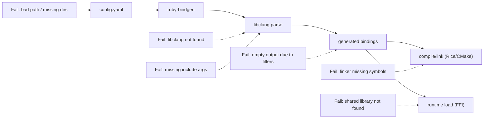

# Troubleshooting

Common failures and how to fix them.

## Pipeline and Failure Points



## `Error: Config file not found`

Cause:
- Wrong path passed to `ruby-bindgen`

Fix:
```bash
ruby-bindgen /absolute/path/to/config.yaml
```

## `Input path must be a directory`

Cause:
- `input:` points to a missing path or file

Fix:
- Set `input:` to an existing directory containing headers

## `Output path must be a directory`

Cause:
- `output:` directory does not exist

Fix:
```bash
mkdir -p /path/to/output
ruby-bindgen config.yaml
```

## `libclang` load failures

Symptoms:
- FFI load error for libclang
- Parser startup fails before processing files

Fix:
- Set the toolchain `libclang` path in config (`clang:` or `clang-cl:`)
- Verify the shared library exists and matches your architecture

Example:

```yaml
clang:
  libclang: /usr/lib/llvm-17/lib/libclang.so
  args:
    - -I/usr/lib/clang/17/include
    - -xc++
```

## Parse errors for standard/library types

Symptoms:
- Many unknown-type diagnostics
- Generated files missing expected classes/functions

Cause:
- Missing include paths or language flags in `clang.args`

Fix:
- Add system and project include paths
- Add `-xc++` for C++ headers (or `-xc` for C)
- Add `-std=c++17` (or your required standard)

## Empty or incomplete generated output

Cause:
- `match` glob too narrow
- `skip` glob too broad
- `export_macros` filters out everything

Fix:
- Validate `match`/`skip` patterns
- Temporarily remove `export_macros` and re-run to confirm filtering

## C++ compile failures after generation

Common causes:
- Missing includes in generated files
- Default argument edge cases
- Symbols declared in headers but not exported by the library

Fix:
- Use `skip_symbols` for problematic APIs
- Add refinement files for custom behavior
- See [Updating Bindings](updating_bindings.md) for durable maintenance workflows

## CMake generation produced empty `target_sources`

Cause:
- No `*-rb.cpp` files in `output` yet

Fix:
- Run `format: Rice` generation first
- Then run `format: CMake`

## FFI runtime cannot load shared library

Cause:
- `library_names` / `library_versions` do not match installed artifacts

Fix:
- Set `library_names` to base names
- Add likely version suffixes to `library_versions`
- Confirm installation path is on loader search path
