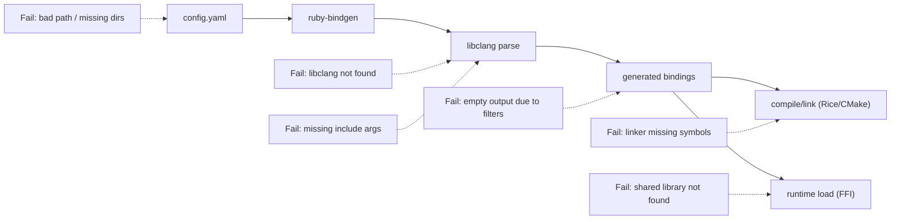

# Troubleshooting

Common failures and how to fix them. Section headings match the exact
error string `ruby-bindgen` prints, so you can search for the message
verbatim.

## Pipeline and Failure Points


```mermaid
flowchart LR
  A["config.yaml"] --> B["ruby-bindgen"]
  B --> C["libclang parse"]
  C --> D["generated bindings"]
  D --> E["compile/link (Rice/CMake)"]
  D --> F["runtime load (FFI)"]

  X1["Fail: bad path / missing dirs"] -.-> A
  X2["Fail: libclang not found"] -.-> C
  X3["Fail: missing include args"] -.-> C
  X4["Fail: empty output due to filters"] -.-> D
  X5["Fail: linker missing symbols"] -.-> E
  X6["Fail: shared library not found"] -.-> F
```

For the full backtrace on any of these errors, set `BINDGEN_DEBUG=1`.

## `Error: Config file not found: <path>`

Cause:
- Wrong path passed to `ruby-bindgen`

Fix:
```bash
ruby-bindgen /absolute/path/to/config.yaml
```

## `Error: Config must specify 'output'`

Cause:
- The YAML file is missing the required top-level `output:` key.

Fix:
- Add `output: /path/to/output/dir` (the directory generated bindings are written to).

## `Error: Config must specify 'format'`

Cause:
- The YAML file is missing the required top-level `format:` key.

Fix:
- Add `format: Rice` (C++ via Rice), `format: FFI` (C via FFI), or `format: CMake` (CMake build files).

## `Error: Format must be 'FFI', 'Rice', or 'CMake', got: <value>`

Cause:
- `format:` is set to something other than the three accepted values. Match is case-sensitive.

Fix:
- Use exactly `Rice`, `FFI`, or `CMake`.

## `Error: Input path must be a directory: <path>`

Cause:
- `input:` points to a missing path or file (not a directory).

Fix:
- Set `input:` to an existing directory containing headers. For `format: CMake`, `input:` defaults to `output:` (the directory containing the generated `*-rb.cpp` files).

## `Error: Output path must be a directory: <path>`

Cause:
- `output:` directory does not exist.

Fix:
```bash
mkdir -p /path/to/output
ruby-bindgen config.yaml
```

## `Error: Project name must be a valid C/C++ identifier (hyphens allowed): <name>`

Cause:
- `project:` contains characters other than letters, digits, underscore, or hyphen, or starts with a digit.

Fix:
- Use a name like `my_extension` or `my-extension`. Hyphens are normalized to underscores in generated C++ identifiers.

## `Error: Rice include header not found: <path>`

Cause:
- `include:` (under a Rice config) names a header that does not exist under `output:`.

Fix:
- Confirm the file path is relative to `output:` and that the header is present before running. Without it, every generated `*-rb.hpp` would `#include` a missing file and the C++ build would fail far from the cause.

## `Error: libclang library not found: <path>`

Cause:
- `clang.libclang:` (or `clang-cl.libclang:`) explicitly points to a missing shared library.

Fix:
- Either correct the path or remove the `libclang:` key and rely on `ffi-clang`'s default discovery.

## `Error: clang args must be a YAML list, got: String`

Cause:
- `clang.args:` (or `clang-cl.args:`) is written as a single string instead of a YAML sequence.

Fix:
```yaml
clang:
  args:
    - -I/usr/include
    - -std=c++17
    - -xc++
```

## `libclang` runtime load failures

Symptoms:
- FFI load error for libclang
- Parser startup fails before processing files

Fix:
- Set the toolchain `libclang` path in config (`clang:` or `clang-cl:`)
- Verify the shared library exists and matches your architecture

Example:

```yaml
clang:
  libclang: /usr/lib/llvm-17/lib/libclang.so
  args:
    - -I/usr/lib/clang/17/include
    - -xc++
```

## Parse errors for standard/library types

Symptoms:
- Many unknown-type diagnostics
- Generated files missing expected classes/functions

Cause:
- Missing include paths or language flags in `clang.args`

Fix:
- Add system and project include paths
- Add `-xc++` for C++ headers (or `-xc` for C)
- Add `-std=c++17` (or your required standard)

## Empty or incomplete generated output

Cause:
- `match` glob too narrow
- `skip` glob too broad
- `export_macros` filters out everything

Fix:
- Validate `match`/`skip` patterns
- Temporarily remove `export_macros` and re-run to confirm filtering

## C++ compile failures after generation

Common causes:
- Missing includes in generated files
- Default argument edge cases
- Symbols declared in headers but not exported by the library

Fix:
- Use `symbols.skip` for problematic APIs, including overload-specific signatures when needed
- Add refinement files for custom behavior
- See [Updating Bindings](updating_bindings.md) for durable maintenance workflows

## CMake generation produced empty `target_sources`

Cause:
- No `*-rb.cpp` files in `output` yet

Fix:
- Run `format: Rice` generation first
- Then run `format: CMake`

## FFI runtime cannot load shared library

Cause:
- `library_names` / `library_versions` do not match installed artifacts

Fix:
- Set `library_names` to base names
- Add likely version suffixes to `library_versions`
- If the library is outside the standard loader path, use `library_search_path` and set the corresponding environment variable at runtime
- Confirm installation path is on loader search path
